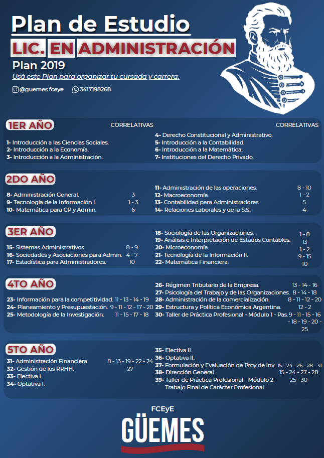

El objeto de la profesión es formar profesionales capaces de: diseñar e implementar herramientas profesionales eficientes para las organizaciones en pos del cumplimiento de sus objetivos y metas. Planificar, organizar, coordinar y controlar las actividades a tal fin. Gestionar estratégicamente las tecnologías de la información. Procurar la administración eficiente de los recursos disponibles para el crecimiento y el desarrollo sostenible de las organizaciones y la sociedad en su conjunto.

## Planes de Estudio

{with=100%}

[Descargar aquí](/planes/LAdm.pdf)
