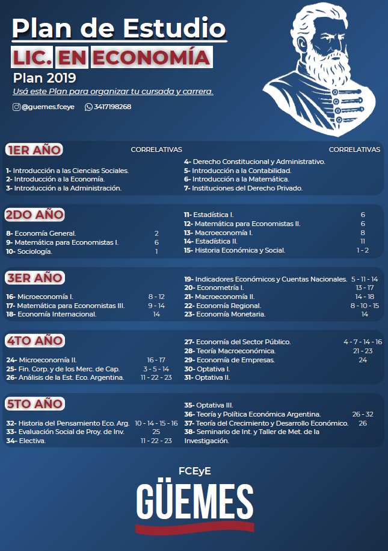

La Licenciatura en Economía tiene por objeto la formación de profesionales capacitados para abordar la interpretación y análisis de las problemáticas sociales, así como también brindar respuestas a las mismas, con sustento en los conocimientos específicos de las áreas que componen la ciencia económica.

## Planes de Estudio

{with=100%}

[Descargar aquí](/planes/LEco.pdf)
