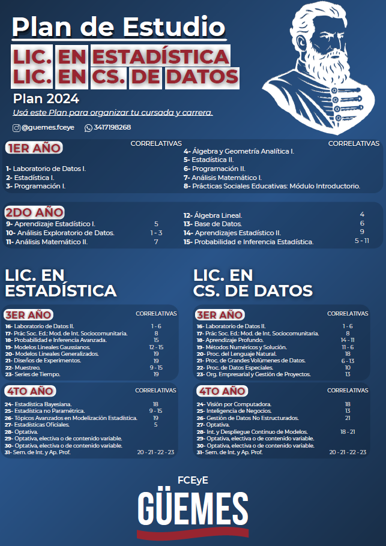

Ambas carreras comparten un Ciclo de Formación Técnica que permite obtener el título intermedio de Técnico/a Universitario en Estadística y Ciencia de Datos. Luego de esta tecnicatura, dependiendo del interés de los estudiantes, es posible realizar el Ciclo de Formación Específica de alguna de las dos carreras.

# Licenciatura en Estadística

El objeto de la profesión refiere a la obtención y el tratamiento de la información relativa a los más variados aspectos de la realidad. La misma comprende el diseño de metodologías para recoger, sintetizar y modelar información cuantitativa de fenómenos aleatorios diversos ofreciendo un método de juicio racional y científico. Asimismo nutre sus conocimientos a partir del trabajo interdisciplinario.

# Licenciatura en Ciencia de Datos

El graduado posee una formación básica en matemática, estadística, ciencia de datos y programación, que le permite colaborar en tareas de procesamiento y análisis primarios de datos. Es capaz de asistir a profesionales en la aplicación de métodos estadísticos inferenciales y modelos predictivos, y puede interpretar resultados y comunicar hallazgos de manera clara. Puede integrar equipos multidisciplinarios, participando en proyectos que persiguen la resolución de problemas en base al análisis de datos en diversas áreas, desde la industria hasta la investigación científica.

# Planes de Estudio

{with="100%"}

[Descargar aquí](/planes/LEyCD.pdf)
